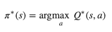

# Navigation

### Q-Learning
Q-learning is a model-free reinforcement learning algorithm to learn the value of an action in a particular state.

For any finite Markov decision process, Q-learning finds an optimal policy by maximizing the expected value of the total reward over any and all successive steps.
Q-learning can identify an optimal policy given infinite exploration time and party-random policy.

The central idea behind Q-learning is we had a function `Q*:State×Action→ℝ `, that function tell us if we took an action, we would get that reward.
With that premise we could construct a policy that maximizes our rewards:

### Implementation

I was not sure about how to start this exercise, so I decided to take as base the work proposed in the previous module.

For my model I built a DNN with 4 linear fully connected layers with 256, 256, 128 and 64 nodes. ReLU inter-layer and Softmax in the output.
I am working with Replay Memory, and soft update for my agent.

My hyperparameters are:
* BUFFER_SIZE, replay buffer size: 100.000
* BATCH_SIZE, minibatch size: 64
* GAMMA, discount factor: 0.99 
* TAU, for soft update of target parameters: 1e-3
* LR, learning rate: 5e-4 
* UPDATE_EVERY, how often to update the network: 4

### Plot

### Model performance

This model took 5537 episodes to achieve the goal.

### Ideas for future work

I tried to implement prioritised experience Replay without success. I would like to give another try.
In the near future I would like to implement the full rainbow tools. One at time for the proposed exercise: **Learning from pixels**.

### Trained Agent

#### References

* https://en.wikipedia.org/wiki/Q-learning
* https://pytorch.org/tutorials/intermediate/reinforcement_q_learning.html