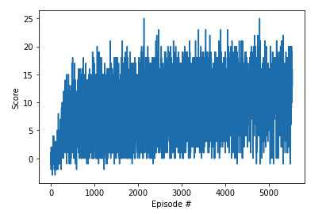

# Navigation

### Implementation

I was not sure about how to start this exercise, so I decided to take as base the work proposed in the previous module.

For my model I built a DNN with 4 linear fully connected layers with 256, 256, 128 and 64 nodes. ReLU inter-layer and Softmax in the output.
I am working with Replay Memory, and soft update for my agent.

### Plot

### Model performance

This model took 5537 episodes to achieve the goal.

### Ideas for future work

I tried to implement prioritised experience Replay without success. I would like to give another try.
In the near future I would like to implement the full rainbow tools. One at time for the proposed exercise: **Learning from pixels**.

### Trained Agent

