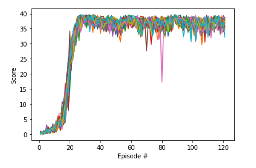

# Continuous Control

## DDPG (Deep Deterministic Policy Gradient)

DDPG is an actor-critic technique that combines Q-Learning and Policy gradients methods.
In DDPG we need to train two model networks: an actor and a critic.

DDPG is used mostly in continuous actions problems.

## Implementation.

Again, like in the previous project, I didn't know where to start. So I decided to give
a first try using the same approach showed in the lessons about actor-critic methods.

I used the same model used to resolve the pendulum problem in the repository
deep-reinforcement-learning of udacity.

I adapted this code to my new environment. My first attempt, it was using a single agent.

I ran my code, and I didn't see any signals of my model was learning.

I decided to try with the multi agent environment, but I was not sure about how to modify
my actual code. I started by create 20 agents, these agents shared the actor and critic models,
along with the memory buffer. I had some issues trying to run my code, and I managed to fix
them, but it was running too slow...

I tried to run my agents in parallel, but as they shared the networks and memory, didn't work.

Then I found a repository with a code similar to my code, but with a smart twist: this agent
runs every step once per real agent. It did make sense to me. So I changed my code in this way.
I found several errors in my old implementation, and I had to change my memory buffer, and my
noise functions because now the whole environment state should be stored in the memory buffer.

### Actor model
I used three fully connected layers (400, 300), `relu` was my activation function interlayer,
and `tanh` for my output, because I wanted values between -1 and 1.

### Critic model
I used three fully connected layers (400, 300), `relu` was my activation function interlayer,
and unmodified output.

### Memory buffer
The same one used in my previous project.

### OUNoise
I'm using this technique for enforcement exploration in my agent. I took the same one from
ddpg pendulum and adapted to my state.

### Hyper-parameters

* BUFFER_SIZE, replay buffer size: 100.000.
* BATCH_SIZE, minibatch size: 128
* GAMMA, discount factor: 0.99
* TAU, for soft update of target parameters: 0.001
* LR_ACTOR, learning rate of the actor: 0.0001
* LR_CRITIC, learning rate of the critic: 0.0001, I had to reduce this because with the
  original value didn't work
* WEIGHT_DECAY, L2 weight decay: 0

### Plot

### Model performance
Environment solved in 121 episodes! Mean score: 36.863.

### Ideas for future work
I would like to work in the crawler environment.

