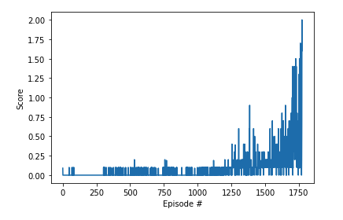

# Collaboration and Competition

## DDPG (Deep Deterministic Policy Gradient)

DDPG is an actor-critic technique that combines Q-Learning and Policy gradients methods.
In DDPG we need to train two model networks: an actor and a critic.

DDPG is used mostly in continuous actions problems.

## Implementation.

According to the multi-agent lessons and the code showed do us, the agents I worked for the
previous project should work for this project.

Actually my previous code works pretty well, but it has some stability issues, and it has a
lot of problems when a new game started.

So I decided trying to improve my model by implementing Prioritized Experience Replay.

I found two papers about it and some blog entries with implementation examples.

I adapted the code, I am pretty happy with my outstanding results.

### Actor model
I used three fully connected layers (400, 300), `relu` was my activation function interlayer,
and `tanh` for my output, because I wanted values between -1 and 1.

### Critic model
I used three fully connected layers (400, 300), `relu` was my activation function interlayer,
and unmodified output.

### Memory buffer
I used a Prioritized Experience Replay. Simple Experience replay works pretty well to avoid
correlation between samples in reinforcement learning, but some experiences are more valuables
than others. Prioritized Memory Replay improves the model performance by giving a better change
to select these valuables experiences often than others.

### OUNoise
I'm using this technique for enforcement exploration in my agent. I took the same one from
ddpg pendulum and adapted to my state.

### Hyper-parameters

* BUFFER_SIZE, replay buffer size: 100.000.
* BATCH_SIZE, minibatch size: 128
* GAMMA, discount factor: 0.99
* TAU, for soft update of target parameters: 0.001
* LR_ACTOR, learning rate of the actor: 0.0001
* LR_CRITIC, learning rate of the critic: 0.0001, I had to reduce this because with the
  original value didn't work
* WEIGHT_DECAY, L2 weight decay: 0

* UPDATE_NN_EVERY, how often to update the network: 1, I am going to update my network every step.
* UPDATE_MEM_EVERY, how often to update the priorities: 20 steps
* UPDATE_MEM_PAR_EVERY, how often to update the hyperparameters: 3000 steps

### Plot

### Model performance
Environment solved in 1774 episodes! Mean score: 0.510

### Ideas for future work

I was looking for ways to improve my model performance, and I only found 
[Self-Adaptive Double Bootstrapped DDPG](https://www.ijcai.org/proceedings/2018/0444.pdf).

It looks a little advanced for me, but I'd like to give a try.

